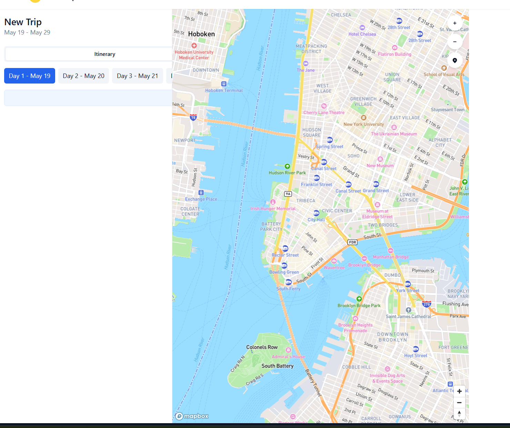
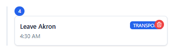
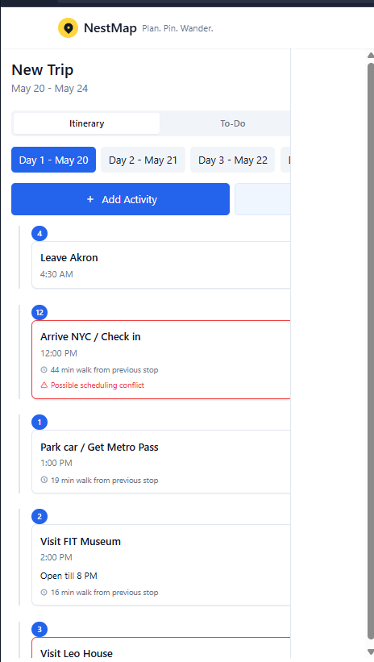
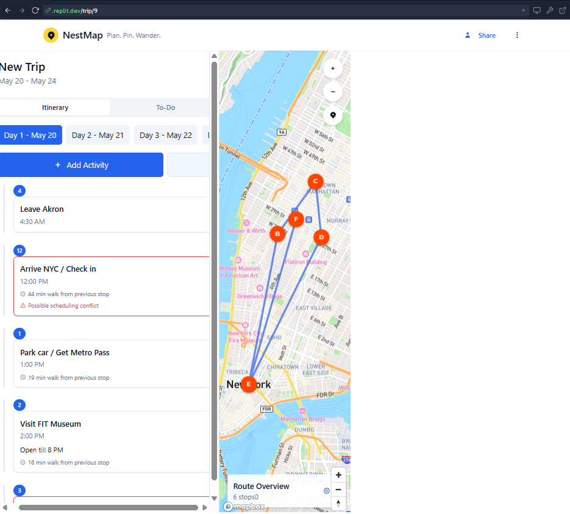
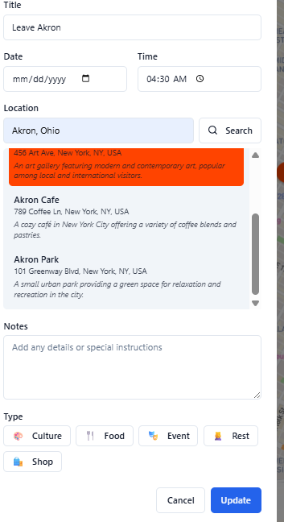

# NestMap Screenshots

This document showcases the main features and interfaces of NestMap.

## Home Page and Trip Cards

The home page displays all your trips with swipe-to-delete and long-press-to-rename gestures on mobile.

## Trip Planning View

The main trip planning interface with map view and activity timeline.

## AI Assistant

The AI assistant provides natural language assistance for trip planning, weather suggestions, and budget recommendations.

## Activity Creation

Adding activities is simple with AI-powered location search.

## Share Trip

Collaborate with others by sharing your trip plans.